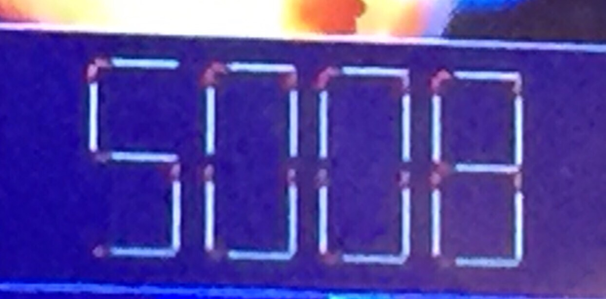

# Stick Numbers
A recent puzzle being shared on whatsapp goes something like this: 

The above number is in "calculator" format made up of sticks. Move any two
sticks and come up with the largest possible number. 

The problem is to generalize this in such a way that the program takes any
arbitrary number as its input, as well as the number of sticks that can be moved
and comes up with the largest number that can be created.
